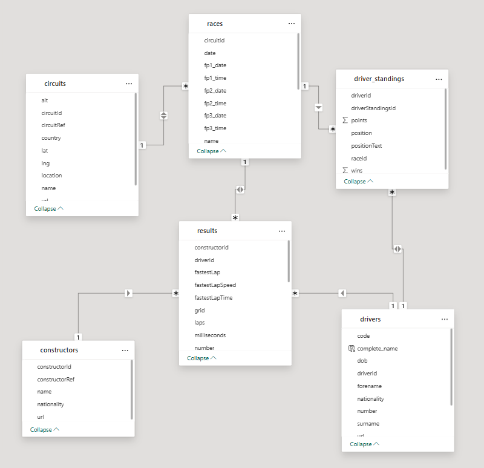
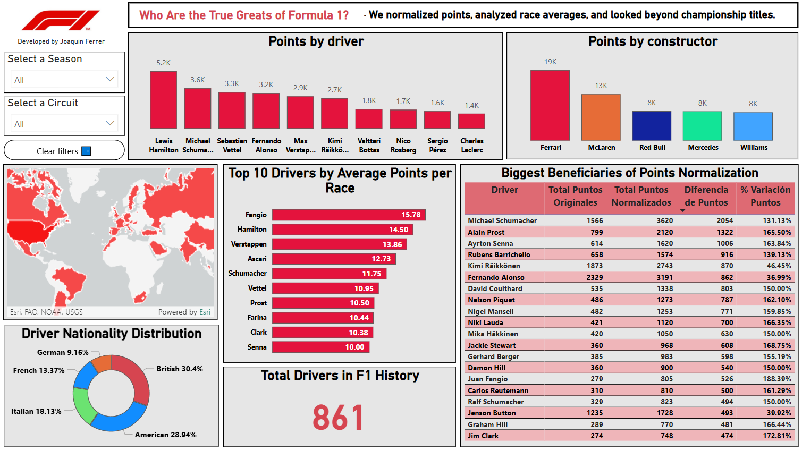

# 🏎️ F1 Historical Performance Dashboard (Power BI)

This interactive Power BI dashboard explores driver performance throughout the history of Formula 1, going beyond championships to evaluate consistency and overall contribution. It aims to answer: **Who are the true greats of Formula 1?**

We normalized points, analyzed race averages, and visualized trends to compare drivers across eras in a fair and insightful way.

---

## 📂 Data Source & Preparation

- All data comes from the [Formula 1 World Championship dataset on Kaggle](https://www.kaggle.com/datasets/rohanrao/formula-1-world-championship-1950-2020)
- I worked with a subset of the `.csv` files provided in the dataset.
- Data cleaning and transformation were handled entirely within **Power Query** in Power BI — no intermediate files were created.
- Only the tables relevant to the analysis were loaded into the model to optimize performance and clarity.

---

## 🧩 Data Model

The dashboard was built using a star schema with clear relationships between circuits, races, drivers, constructors, and results:

---

## 📈 Methodology – Points Normalization

Formula 1's scoring system has changed significantly over time, making raw point totals misleading for cross-era comparisons. To address this, I normalized all driver points using the following logic:

- **Original points** were adjusted based on the scoring system in place during each season.
- **Normalized points** reflect what each driver *would have scored* under a consistent system.
- This allowed me to calculate meaningful KPIs like:
  - **Total Normalized Points**
  - **Average Points per Race**
  - **Variation vs. Original Points**

This approach highlights underappreciated drivers from older eras whose raw totals were limited by shorter calendars and lower scoring.

---

## 📊 Dashboard Insights

The dashboard is fully interactive and includes:

- **Normalized Points by Driver**: Highlights long-term performers
- **Points by Constructor**: Total historical performance
- **Average Points per Race**: Top 10 most efficient drivers
- **Nationality Distribution**: Share of F1 drivers by country
- **Points Normalization Impact**: Who benefits the most from score normalization?
- **Total Drivers Counter**: All-time total

### 🧠 Key Insights:
- Juan Manuel Fangio leads in average points per race (15.78), despite fewer total points.
- Schumacher, Prost and Senna gained massively after normalization — a sign of domination in low-scoring eras.
- British, American and Italian drivers make up the bulk of F1’s historical grid.

---

## 🛠️ Tools Used

- **Power BI** – Dashboard design, DAX, and data modeling
- **Power Query** – Data transformation
- **DAX** – Custom measures and KPIs
- **Kaggle Dataset** – Raw historical data (1950–2020)

---

## 👨‍💻 About Me

**Joaquín Ferrer**  
Industrial Engineering | Data Analytics | Power BI | SQL  

🔗 [LinkedIn](https://www.linkedin.com/in/joaqu%C3%ADnferrer/) 
📘 [Notion Portfolio](https://sun-sofa-ba8.notion.site/Joaqu-n-Ferrer-Portafolio-Profesional-2163e852260a808f9377e971506e0f1f?source=copy_link) 
💻 [GitHub](https://github.com/joacoferrer00)

---

